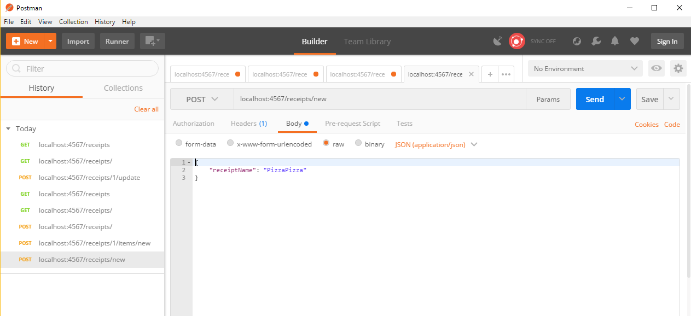
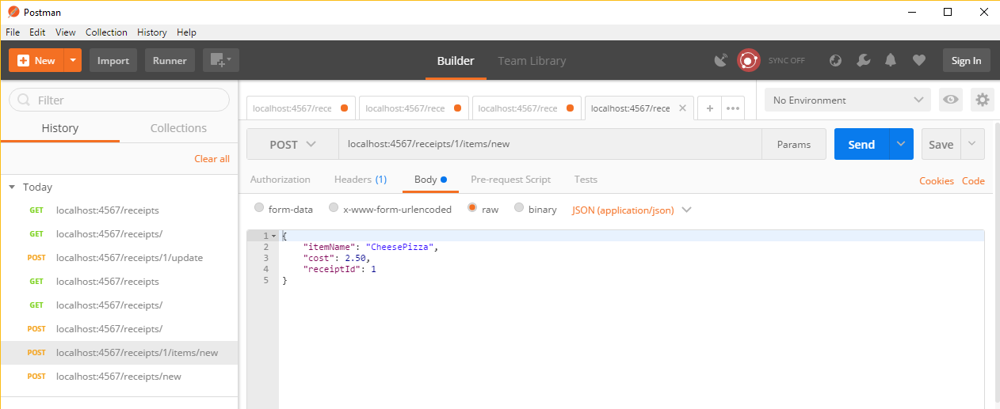

# BillSplitting

Split bills into itemized receipts.

This is an Epicodus friday project for Java that focuses on API development.

## Getting Started

To run this application you will need to clone/download the contents of the repository and compile them through IntelliJ IDEA.

Once the application is running, open index.html with a browser. (located in html folder)

### Prerequisites

You will need the following packages and software installed:

```
Java JDK 1.8.0_151
JAVA JRE 1.8.0_151
IntelliJ IDEA
```
### Specifications
| Behavior | Input | Expected Behavior |
| :------------- | :------------- | :------------- |
| Keeps track of users who participated in receipt | Add user to application | User is added to the h2 SQL database |
| Keeps track of all Receipts added to app | A receipt is added through form | Receipt is given unique ID and is added to H2 SQL database |
| Keeps track of items added to app | An item is added through form | Items are added to H2 SQL database and given ids to match receipts |

### Routing Examples with POSTMAN
Add Receipt via Routing


Add Item to Receipt


View All Receipts


## Built With

* [IntelliJ IDEA](https://www.jetbrains.com/idea/) - JAVA IDE

## Authors

* **Byron Chang** - [thebyronc](https://github.com/thebyronc/)

## License

This project is licensed under the MIT License - see the [LICENSE.md](LICENSE.md) file for details
